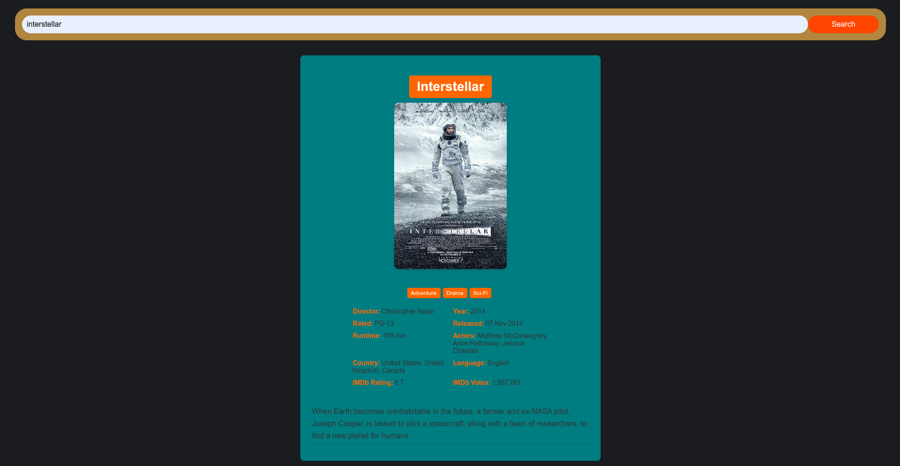

# 🎬 MovieWizard - Personalized Movie Discovery Platform

## 🌟 Overview

MovieWizard is a modern, personalized movie recommendation platform built with React. It combines elegant design with powerful functionality to help users discover their next favorite film through an intuitive and visually stunning interface.

## ✨ Features

### 🎯 Core Functionality
- **Smart Movie Search**: Real-time movie search with OMDB API integration
- **Detailed Movie Information**: Complete movie details including cast, director, ratings, and plot
- **Visual Movie Display**: High-quality poster images with smooth hover animations

### 👤 Personalization
- **Custom User Profiles**: Personalized welcome messages and user identification
- **Favorites System**: Save and track your favorite movies with one click
- **Genre Preferences**: Rate different movie genres to get better recommendations
- **Tailored Experience**: Platform adapts to user preferences over time

### 🎨 Modern UI/UX
- **Glassmorphism Design**: Beautiful frosted glass effects and modern aesthetics
- **Gradient Backgrounds**: Stunning purple-to-indigo gradient backgrounds
- **Smooth Animations**: Hover effects, loading states, and micro-interactions
- **Responsive Layout**: Optimized for desktop, tablet, and mobile devices

### 🔧 Advanced Features
- **Loading States**: Professional loading animations during API calls
- **Error Handling**: User-friendly error messages and suggestions
- **Interactive Elements**: Hover effects, scale transforms, and smooth transitions
- **Custom Sliders**: Beautiful gradient sliders for genre rating

## 🚀 Getting Started

### Prerequisites
- Node.js (v14 or higher)
- npm or yarn package manager

### Installation

1. **Clone the repository**
   ```bash
   git clone [repository-url]
   cd moviewizard
   ```

2. **Install dependencies**
   ```bash
   npm install
   ```

3. **Start the development server**
   ```bash
   npm start
   ```

4. **Open your browser**
   Navigate to `http://localhost:3000`

### API Setup
To use real movie data, you'll need an OMDB API key:
1. Visit [OMDB API](http://www.omdbapi.com/)
2. Register for a free API key
3. Replace the mock data with actual API calls

## 🛠️ Technology Stack

- **Frontend Framework**: React 18
- **Styling**: Tailwind CSS
- **Icons**: Lucide React
- **State Management**: React Hooks (useState)
- **API Integration**: Fetch API
- **Responsive Design**: CSS Grid & Flexbox

## 📁 Project Structure

```
src/
├── App.js                 # Main application component (updated)
├── index.js              # Application entry point
├── components/           # Legacy components (no longer used)
│   ├── SBSB.jsx
│   ├── RatingTab.jsx
│   ├── searchBar.jsx
│   └── suggestionBar.jsx
└── components/styles/    # Legacy CSS files (no longer used)
```

## 🎯 Key Improvements Made

### Visual Enhancements
- Modern glassmorphism design with backdrop blur effects
- Beautiful gradient backgrounds and color schemes
- Smooth animations and micro-interactions
- Professional loading states and transitions

### User Experience
- Personalized welcome messages
- Favorites system for saving movies
- Interactive genre rating system
- Responsive design for all devices

### Code Quality
- Consolidated components into a single, maintainable file
- Modern React hooks for state management
- Clean, readable code structure
- Improved error handling

## 🎮 How to Use

1. **Enter Your Name**: Personalize your experience by entering your name
2. **Search Movies**: Type any movie title in the search bar
3. **Explore Details**: View comprehensive movie information with beautiful visuals
4. **Rate Genres**: Use the sliders to rate different movie genres
5. **Save Favorites**: Click the heart icon to add movies to your favorites
6. **Get Recommendations**: The system learns from your preferences

## 🔮 Future Roadmap

- **Music Integration**: Expand to include music recommendations
- **Backend Infrastructure**: Implement robust backend with user authentication
- **Advanced Algorithms**: Machine learning-powered recommendation engine
- **Social Features**: Share favorites and recommendations with friends
- **Mobile App**: Native mobile applications for iOS and Android

## 🤝 Contributing

We welcome contributions! Here's how you can help:

### We're Looking For:
- **UI/UX Developers**: Enhance user interface and experience design
- **Backend Developers**: Build robust backend infrastructure
- **Data Scientists**: Improve recommendation algorithms

### How to Contribute:
1. Fork the repository
2. Create a feature branch
3. Make your changes
4. Submit a pull request

## 📞 Contact

**Project Creator**: Ali Pourrahim
- **LinkedIn**: [linkedin.com/in/alipourrahim](https://www.linkedin.com/in/alipourrahim/)

## 📄 License

This project is open source and available under the [MIT License](LICENSE).

## 🎉 Acknowledgments

- OMDB API for movie data
- React community for excellent documentation
- Tailwind CSS for beautiful styling utilities
- Lucide React for beautiful icons

---

**Made with ❤️ for movie lovers everywhere**

